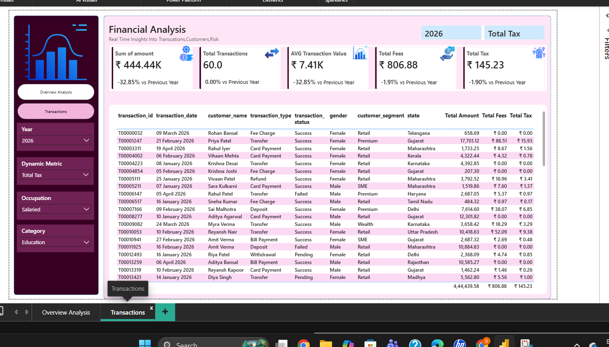
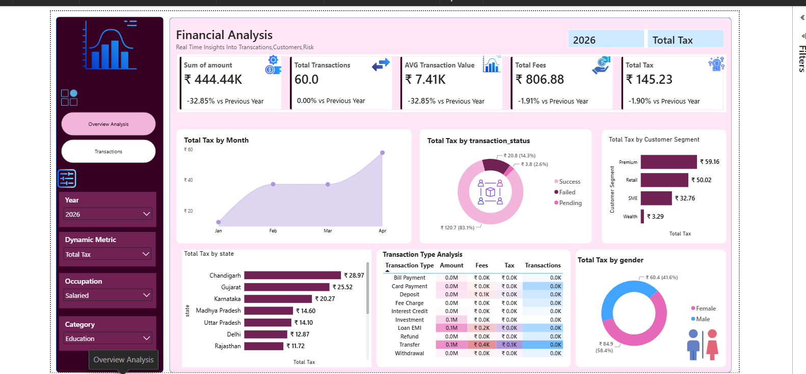

# Financial Analytics Dashboard

## Overview

This project presents an interactive Financial Analytics Dashboard developed using Power BI to analyze transaction data, customer behavior, tax contributions, and financial performance metrics.
## Dashboard Preview

### Overview Dashboard

### Transactions Dashboard

## Tools & Technologies

* Power BI
* DAX
* Power Query
* Python
* Pandas
* Scikit-Learn

## Key Features

* KPI Monitoring Dashboard
* Customer Segmentation Analysis
* State-wise Tax Analysis
* Transaction Type Analysis
* Gender-wise Insights
* Dynamic Filters and Slicers
* Transaction Drill-down Reports

## Dataset

The dataset contains financial transaction records including:

* Transaction Amount
* Fees
* Taxes
* Customer Segments
* Transaction Types
* Transaction Status
* State-wise Information

## Business Insights

* Identified customer segments contributing maximum tax revenue.
* Analyzed state-wise financial performance.
* Evaluated transaction success and failure rates.
* Monitored monthly tax trends and transaction volume.

## Additional Analysis

A Linear Regression model was implemented to demonstrate profit estimation using transaction amount, fee amount, and tax amount.

## Results

* Total Transactions: 60+
* Total Amount Processed: ₹4.44 Lakhs
* Interactive Dashboard with Dynamic Filtering

## Future Enhancements

* Real-time data integration
* Revenue forecasting
* Fraud detection analytics
* Customer churn prediction
